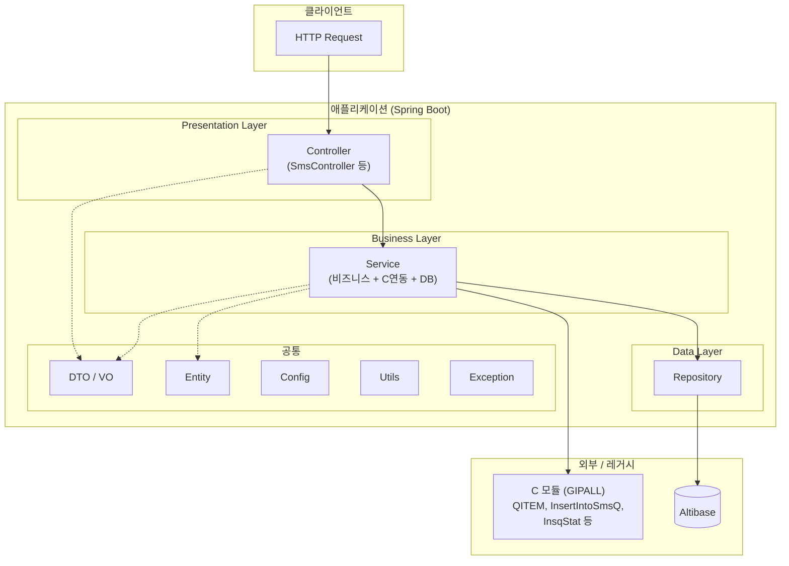
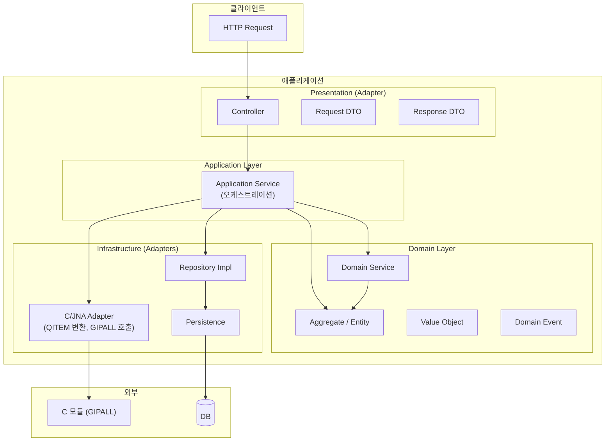
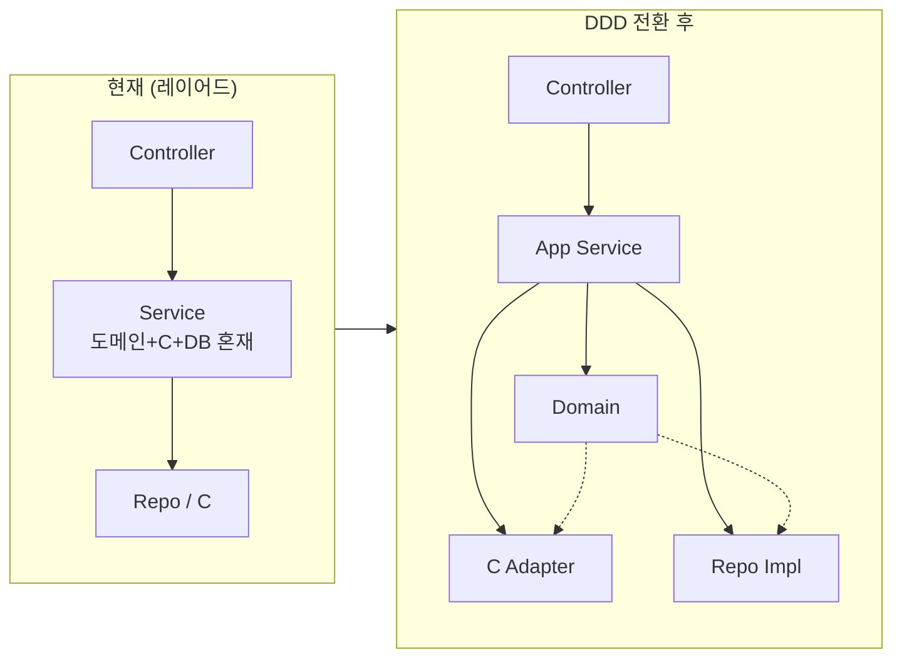
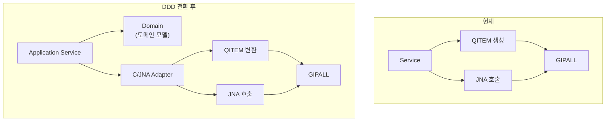

# SKT GIP HTTP 아키텍처 — 현재 구조와 DDD 전환 방향

**문서 목적**: 회의 보고용 — 이전 프로젝트(현재 구조)와 DDD 패턴 전환 방향 정리  
**참조**: `.cursor/rules` (패키지 구조, C/JNA 연동, 코드 컨벤션)

---

## 1. 현재 아키텍처 (레이어드)

HTTP 수신 → 서비스에서 비즈니스·C 연동·DB 처리 혼재.



### 1.1 현재 패키지 구조 (rules 기준)

```
com.infra.recv.skt_giphttp_recv/
├── config/           # 설정
├── controller/       # HTTP 진입점
├── service/          # 비즈니스 + C연동 + 조합
├── repository/       # DB 접근
├── entity/           # DB 엔티티
├── dto/              # 요청/응답, JNA(QITEM 등)
├── utils/            # 공통 유틸
└── exception/        # 예외
```

### 1.2 현재 구조의 특징

| 항목 | 설명 |
|------|------|
| **데이터 흐름** | Controller → Service → Repository / C 모듈 |
| **도메인 계층** | 없음. 비즈니스 규칙이 Service에 혼재 |
| **C 연동** | Service에서 QITEM 생성·JNA 호출 직접 수행 |
| **용어** | QITEM, usMsgCode, nRsv4Protocol 등 C/레거시 중심 |

---

## 2. DDD 전환 목표 아키텍처

도메인 계층을 두고, C/JNA·DB·HTTP는 각각 인프라/어댑터로 격리.



### 2.1 DDD 패키지 구조 (제안)

```
com.infra.recv.skt_giphttp_recv/
├── application/          # Application Service
│   └── sms/
├── domain/               # Domain Layer
│   └── sms/
│       ├── model/        # Aggregate, Entity, Value Object
│       ├── service/      # Domain Service
│       └── repository/   # Repository Interface (port)
├── infrastructure/       # Adapters
│   ├── adapter/
│   │   ├── jna/          # QITEM 매핑, GIPALL 호출
│   │   └── persistence/ # Repository 구현
│   └── config/
├── presentation/         # HTTP
│   └── controller/
└── common/               # 공통 DTO, 예외, 유틸
```

### 2.2 계층별 역할

| 계층 | 역할 |
|------|------|
| **Presentation** | HTTP 수신/응답, DTO 변환만 담당 |
| **Application** | 유스케이스 오케스트레이션, 트랜잭션 경계 |
| **Domain** | 비즈니스 규칙, 유비쿼터스 언어(메시지/전달결과/통계 등) |
| **Infrastructure** | C/JNA 연동(QITEM), DB, 설정 등 외부 연동 구현 |

---

## 3. 전환 전·후 비교 다이어그램



---

## 4. C 연동 위치 비교



- **현재**: Service가 도메인 로직과 QITEM/JNA를 함께 처리.
- **DDD**: 도메인은 순수 모델만 다루고, QITEM·GIPALL 호출은 C/JNA Adapter에만 존재.

---

## 5. 요약

| 구분 | 현재 (레이어드) | DDD 전환 후 |
|------|------------------|-------------|
| **구조** | controller / service / repository | application / domain / infrastructure |
| **도메인** | Service에 혼재 | Domain 모델·도메인 서비스로 응집 |
| **C/JNA** | Service에서 직접 사용 | Adapter에서만 QITEM·GIPALL 사용 |
| **용어** | C/레거시(QITEM 등) 중심 | 유비쿼터스 언어(도메인 용어) 중심 |

rules의 **패키지 구조·C 연동 규칙·코드 컨벤션**은 유지하면서, **도메인 계층 분리**와 **Adapter 격리**로 DDD 방향 전환을 목표로 한다는 내용으로 회의 보고에 사용할 수 있습니다.
