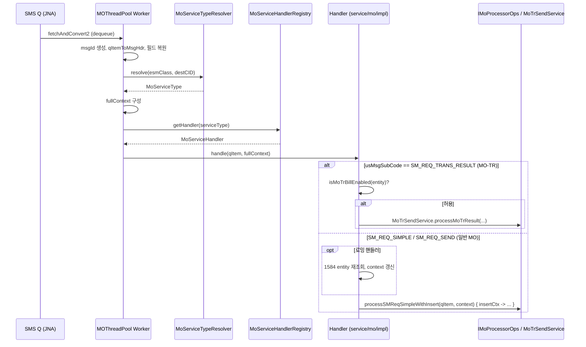
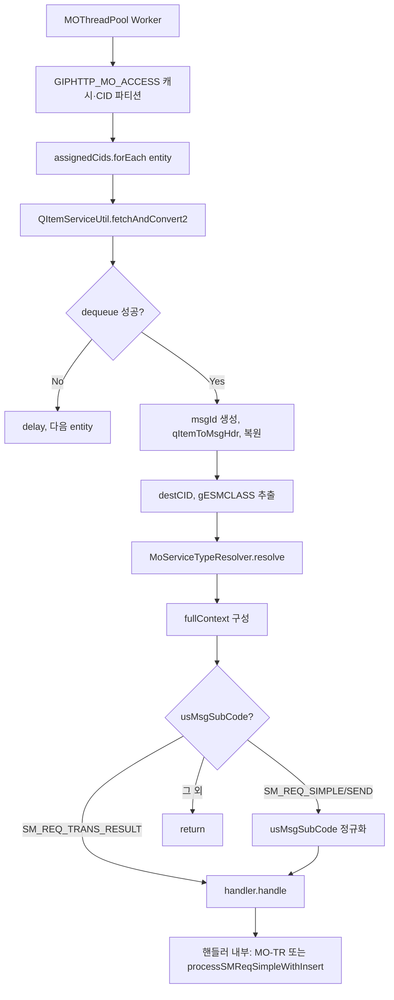

# GIPHTTP MO 시스템 플로우

**규칙: MO는 subcode를 구분하지 않는다.** (usMsgSubCode / SM_REQ_SIMPLE / SM_REQ_TRANS_RESULT 등 subcode별 분기 없이 MO 처리. 관련 로직 수정은 별도 반영.)

## 1. 전체 MO 처리 흐름 (MOThreadPool → 핸들러)

```
┌─────────────────────────────────────────────────────────────────────────────────┐
│  MOThreadPool (Worker 스레드)                                                      │
│  - GIPHTTP_MO_ACCESS 캐시 기반 CID 파티션 (Worker당 할당 CID 목록)                   │
└─────────────────────────────────────────────────────────────────────────────────┘
                                        │
                                        ▼
┌─────────────────────────────────────────────────────────────────────────────────┐
│  큐에서 데이터 취득                                                                │
│  QItemServiceUtil.fetchAndConvert2(queueNo, smsQLib, witcomLog)                   │
│  → GetAMsgFromSmsQ (JNA) → QueueResult(gstQItemTrans, qItem)                       │
└─────────────────────────────────────────────────────────────────────────────────┘
                                        │
                                        ▼
┌─────────────────────────────────────────────────────────────────────────────────┐
│  QITEM 전처리                                                                     │
│  - msgId 생성 (dequeue 직후)                                                       │
│  - qItemToMsgHdr 호출 후 필드 복원 (ESMClass, traceId, msg 등)                       │
│  - gESMCLASS = qItem.nRsv4Protocol[11], destCID = szCId                            │
└─────────────────────────────────────────────────────────────────────────────────┘
                                        │
                                        ▼
┌─────────────────────────────────────────────────────────────────────────────────┐
│  ESMClass·번호규칙 → 서비스 타입 결정                                              │
│  serviceType = MoServiceTypeResolver.resolve(gESMCLASS, destCID)                   │
│  - 번호규칙 우선: 1584, 638, 2580, #(등기) → CHARACTER_1584, SMS_MANAGER_638, ...  │
│  - 미매칭 시 ESMClass 기준: CDMA/GSM 로밍, NOTI_PLUS, NOTI_REGISTERED, NORMAL_MO 등 │
└─────────────────────────────────────────────────────────────────────────────────┘
                                        │
                                        ▼
┌─────────────────────────────────────────────────────────────────────────────────┐
│  fullContext 구성                                                                │
│  MoServiceContext(destCID, esmClass, entity, queueNo, gstQItemTrans,             │
│    witcomLog, smsQLib, gServerID, cfgEtcMap, gstQResultObj, moProcessorOps=null)  │
└─────────────────────────────────────────────────────────────────────────────────┘
                                        │
                    ┌───────────────────┴───────────────────┐
                    │  usMsgSubCode (덮어쓰기 전 저장)        │
                    └───────────────────┬───────────────────┘
                                        │
          ┌─────────────────────────────┼─────────────────────────────┐
          ▼                             ▼                             ▼
┌─────────────────────┐   ┌─────────────────────┐   ┌─────────────────────┐
│ SM_REQ_TRANS_RESULT │   │ SM_REQ_SIMPLE        │   │ 그 외                │
│ (MO-TR)             │   │ SM_REQ_SEND         │   │ → 처리 안 함         │
└──────────┬──────────┘   └──────────┬──────────┘   └─────────────────────┘
           │                          │
           │                          │ (SM_REQ_SEND → SM_REQ_SIMPLE 정규화)
           ▼                          ▼
┌─────────────────────────────────────────────────────────────────────────────────┐
│  handler.handle(gstQItem, fullContext)                                            │
│  MoServiceHandlerRegistry.getHandler(serviceType).handle(...)                     │
│  → NormalMoHandler | Character1584Handler | SmsManager638Handler | ...            │
└─────────────────────────────────────────────────────────────────────────────────┘
```

---

## 2. 핸들러 내부 플로우 (Application Service)

```
┌─────────────────────────────────────────────────────────────────────────────────┐
│  Handler.handle(qItem, context)                                                  │
└─────────────────────────────────────────────────────────────────────────────────┘
                                        │
                    ┌───────────────────┴───────────────────┐
                    ▼                                       ▼
         usMsgSubCode == SM_REQ_TRANS_RESULT?        그 외 (SM_REQ_SIMPLE 등)
                    │                                       │
                    ▼                                       ▼
┌─────────────────────────────────────┐   ┌─────────────────────────────────────┐
│ MO-TR 분기                           │   │ 일반 MO 분기                          │
│ - MoBillTypeService.isMoTrBillEnabled│   │ (로밍: 1584 entity 재조회 후 context)  │
│   (context.entity) 체크              │   │ - moProcessorOps.processSMReqSimple  │
│ - 허용 시 MoTrSendService            │   │   WithInsert(qItem, context) { ... }  │
│   .processMoTrResult(...)            │   │   → DB INSERT, CP 전송, InsqStat 등  │
│ - 비허용/컨텍스트 부족 시 return     │   │ - 도메인별 INSERT: MoDomainInsertReg  │
└─────────────────────────────────────┘   └─────────────────────────────────────┘
```

---

## 3. 서비스 타입별 핸들러 매핑

| MoServiceType       | 핸들러 클래스           | 비고 |
|---------------------|--------------------------|------|
| NORMAL_MO           | NormalMoHandler          | 일반 MO, 1584 검증(앞자리 1584) 시 1584로 넘기지 않고 일반 MO로 처리 가능 |
| CHARACTER_1584       | Character1584Handler     | 앞자리 1584 (번호규칙) |
| SMS_MANAGER_638      | SmsManager638Handler     | 638 문자매니저 |
| SMS_MESSENGER_2580   | SmsMessenger2580Handler  | 2580 문자매신저 |
| CDMA_ROAMING         | CdmaRoamingHandler       | 1584 entity 재조회 후 context 전달 |
| GSM_ROAMING          | GsmRoamingHandler        | 1584 entity 재조회 후 context 전달 |
| NOTI_PLUS            | NotiPlusHandler          | 안심문자 |
| NOTI_REGISTERED       | NotiRegisteredHandler    | 등기문자 (번호+#) |
| SPECIAL_SHARP        | (등기 확인용)            | 번호+# |
| 기타                 | ForwardHandler 등        | 착신전환 등 |

---

## 4. Mermaid 시퀀스 다이어그램 (MO 처리)



---

## 5. Mermaid 플로우차트 (MOThreadPool → 핸들러 분기)



---

## 6. 참조

- ESMClass 분기·서비스 리스트: `ESMClass_서비스_리팩토링_규칙.mdc`
- 통계·과금 호출 위치: `통계_과금_ESMClass별_설계.md`
- DDD 단계·체크리스트: `DDD_단계별_개발_계획.md`
